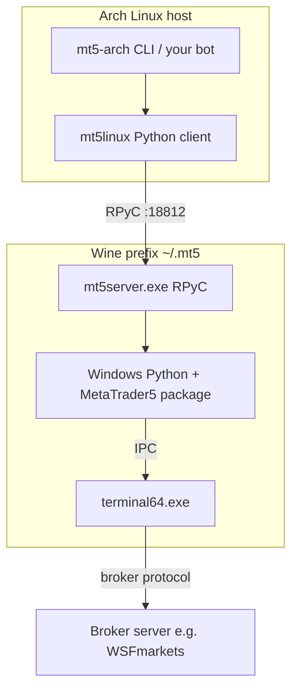

# Architecture

## Overview

This repository is a **platform integration layer**: it makes MetaTrader 5 usable from native Linux Python on Arch, without requiring a Windows machine.

## Why RPyC / mt5linux?

The official [`MetaTrader5`](https://pypi.org/project/MetaTrader5/) package only runs on **Windows Python** because it talks to the terminal over a Windows IPC channel. On Linux:

1. MT5 runs under **Wine**.
2. `mt5server.exe` (from [mt5linux](https://github.com/lucas-campagna/mt5linux)) embeds the Windows-side stack and exposes an **RPyC** server (default port **18812**).
3. Native Linux Python uses `from mt5linux import MetaTrader5` with nearly the same API as MetaQuotes.

## Components in this repo

| Piece | Role |
|-------|------|
| `scripts/0x-*.sh` | Install Wine prefix, MT5, mt5server; start processes |
| `src/mt5_arch` | Thin typed wrapper + CLI around mt5linux |
| `ops/systemd` | Optional user units for terminal + RPyC |
| `docs/` | Arch-specific setup and troubleshooting |

## Relationship to `mt5-trading-agent`

| Repo | Responsibility |
|------|----------------|
| **mt5-arch-integration** (this) | Wine MT5 + RPyC + Linux Python API |
| **mt5-trading-agent** | Risk, lot sizing, strategies, paper/live modes |

The agent currently expects a REST bridge. You can:

- Call `mt5linux` / `mt5_arch` directly from the agent, or
- Add a FastAPI adapter later that implements the agent's REST contract on top of this client.

## Security model

- RPyC should bind to **localhost** only.
- Account passwords live in `.env` (gitignored).
- Wine prefix and installers are never committed.
