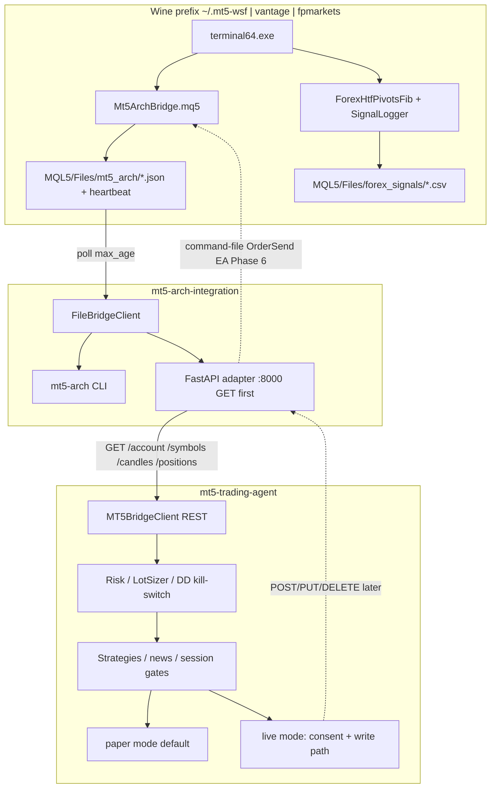

# Algo trading research: BTC, Gold, Forex majors

**Date:** 2026-08-04  
**Status:** Research draft  
**Branch context:** `research/algo-trading-btc-gold-forex`  
**Scope:** Platform (`mt5-arch-integration`) + agent (`mt5-trading-agent`) gap analysis for multi-asset algo readiness.  
**Authority:** Sources of truth listed in [§10 Sources](#10-sources--references). Do not invent platform features beyond those sources.

---

## 1. Executive summary

`mt5-arch-integration` is a **platform layer only**: Wine MT5 + preferred file-bridge EA (`Mt5ArchBridge.mq5`) + optional RPyC/mt5linux, exposing typed Python reads (account, symbols, candles) via a thin CLI. It does **not** implement order placement, REST, strategies, risk managers, Telegram, or TimescaleDB ([`AGENTS.md`](../../AGENTS.md)).

`mt5-trading-agent` is the **app layer** (risk, lot sizing, strategies, paper/live) scaffolded around an **HTTP REST bridge** (`MT5BridgeClient` → `http://localhost:8000` with GET account/symbols/candles/positions and POST/PUT/DELETE orders requiring SL/TP + `idempotency_key`). That REST surface **does not exist** in the platform today. `docs/ARCHITECTURE.md` states the agent still needs a FastAPI adapter **or** direct `mt5_arch` use.

| Layer | What works today | Blocker for live multi-asset |
|-------|------------------|------------------------------|
| Platform file bridge | EA writes `account.json`, `terminal.json`, `symbols.json`, `candles_*`, `positions.json`, `heartbeat.txt` | `FileBridgeClient` has no positions reader; no OrderSend |
| Platform CLI | `ping`, `account`, `symbols`, `candles`, `brokers`, `config` | No `positions` / order commands |
| Forex MQL5 pack | HTF Fib indicator + signal logger (never OrderSend) | Wave C level JSON not shipped; live EA roadmap-only |
| Agent | executor / lot_sizing / risk / strategies / paper mode | Depends on missing REST write path; margin math unsafe for BTC CFD |

**Asset readiness (research judgment):**

- **Forex majors + XAUUSD:** Best fit for the shipped observe path (bridge defaults include them; Fib structure + logger designed for FX/gold). Proceed Wave B journal first.
- **BTC CFD:** P1 — must discover exact broker symbol + contract specs live; do not reuse FX pip/session helpers; fix agent margin formula before any sizing.
- **Live automation:** Not ready. Default agent mode is paper; no live orders without explicit flag + user consent.

**Recommended posture:** Keep risk/strategies in the agent; keep platform as data (and later order plumbing) only; close the agent gap with a localhost FastAPI GET adapter over `FileBridgeClient`, then command-file OrderSend with SL/TP + idempotency. Prefer one Wine prefix per broker brand (`~/.mt5-wsf`, `~/.mt5-vantage`, `~/.mt5-fpmarkets`).

---

## 2. Stack inventory (platform vs agent)

### 2.1 Platform — `mt5-arch-integration`

| Capability | Detail |
|------------|--------|
| Purpose | Wine MT5 + thin typed Python CLI; no strategy engines |
| Backends | `MT5_BACKEND=file` (default, recommended); `MT5_BACKEND=rpyc` optional (`:18812`, often IPC timeout under Wine 11) |
| CLI | `mt5-arch ping \| account \| symbols \| candles \| brokers \| config` (JSON via `--json`) |
| Models | `AccountInfo`, `SymbolInfo`, `Candle`, `CandlesResult`, `TerminalInfo` — agent-compatible shapes where practical |
| File bridge EA | `mql5/Mt5ArchBridge.mq5` — read snapshots + `WritePositions`; **no OrderSend** |
| EA outputs | `MQL5/Files/mt5_arch/{account,terminal,symbols,candles_{SYM}_{TF},positions}.json`, `heartbeat.txt` |
| EA defaults | `InpSymbols=EURUSD,GBPUSD,USDJPY,XAUUSD,USDCHF`; TFs `M15,H1,H4,D1`; timer ≥1s |
| Staleness | `MT5_BRIDGE_MAX_AGE` (e.g. wsf.env 60s) fails stale reads |
| Forex pack | `ForexUtils.mqh`, `ForexHtfPivotsFib.mq5`, `ForexIndicatorTemplate.mq5`, `ForexSignalLogger.mq5` |
| Install forex | `./scripts/18-install-forex-indicator.sh` |
| Brokers | `config/brokers/{wsf,vantage,fpmarkets}.env`; switch via `./scripts/16-use-broker.sh` or `uv run mt5-arch brokers` |
| Wine prefixes | Preferred: `~/.mt5-wsf`, `~/.mt5-vantage`, `~/.mt5-fpmarkets`; legacy `~/.mt5` |
| Explicitly **not** in repo | Python OrderSend, REST/FastAPI server, strategies, risk, Telegram, TimescaleDB |

**Existing MQL5 inventory:**

| Path | Role |
|------|------|
| `mql5/Mt5ArchBridge.mq5` | File bridge EA (snapshots; positions write; no OrderSend) |
| `mql5/Include/ForexUtils.mqh` | Pips / sessions / pivots / EMA-ATR-RSI helpers (FX-oriented) |
| `mql5/Indicators/ForexHtfPivotsFib.mq5` | HTF pivots+Fib; signal buffer **7** (+1/−1/0); fib618=4, fib786=5, swingDir=6 |
| `mql5/Indicators/ForexIndicatorTemplate.mq5` | EMA cloud/PDH; signal buffer **8** |
| `mql5/Experts/ForexSignalLogger.mq5` | `iCustom` → Print/CSV under `MQL5/Files/forex_signals/`; **never OrderSend** |

### 2.2 Agent — `mt5-trading-agent`

| Capability | Detail |
|------------|--------|
| Purpose | Risk, lot sizing, strategies, paper/live execution policy |
| Bridge client | `MT5BridgeClient` expects REST `base_url` (e.g. `http://localhost:8000`) |
| REST contract (expected) | GET `/account`, `/symbols/{s}`, `/candles/{s}`, `/positions`; POST `/orders/market` (SL/TP required + `idempotency_key`); PUT/DELETE positions |
| Scaffold | executor / lot_sizing / risk / strategies / ingest |
| Default mode | `trading_execution.mode=paper`; live requires real bridge + consent |
| Lot math | Uses `tick_value * (point / tick_size)` for risk lots when specs are live |
| Known bug | `can_open_with_margin` uses `volume * contract_size / leverage` **without price** — unsafe when `contract_size ≈ 1` (BTC CFD) |
| Mature pattern reference | `ctrader-trading-agent` CLI loop → risk → strategy → execution/paper_tracker |

### 2.3 The agent gap (critical)

```
Agent expects:  REST @ localhost:8000  (GET + POST/PUT/DELETE with SL/TP + idempotency)
Platform has:   FileBridgeClient (read) + RPyC diagnostic + CLI
Missing:        FastAPI adapter OR direct mt5_arch use from agent;
                FileBridgeClient.positions(); OrderSend write path;
                Wave C fib/signal JSON to Python; production Timescale/Prometheus/Telegram wiring
```

Platform `docs/ARCHITECTURE.md` explicitly notes: add FastAPI over this client **or** call `mt5_arch` directly from the agent. Platform boundary ([`AGENTS.md`](../../AGENTS.md)): only plumbing—not risk bots.

### 2.4 Operational constraints (non-negotiable)

- Secrets only via `.env`; **never log `MT5_PASSWORD`**.
- RPyC bind **localhost** only.
- File bridge needs Algo Trading green + EA on chart; stale heartbeat fails reads.
- `TERMINAL_CONNECTED` often false under Wine → use **effective-connection** heuristics already in EA/CLI.
- Multi-broker is **partial** (server list + Wine auth); prefer **one prefix per brand**.
- No live orders in smoke tests without explicit live flag **and** user consent.
- Forex roadmap: observe/logger first; no live trading EA until later waves.
- Agent default paper; live only with real bridge.

---

## 3. Asset deep-dives

### 3.1 BTC (crypto CFD)

#### Market structure

| Topic | Notes |
|-------|--------|
| Product type | Retail MT5 BTC is almost always a **cash-settled CFD**, not custodial spot |
| Canonical name | `BTCUSD`; brokers may use `BTCUSDT`, micro variants (`BTCUSDc`, contract_size 0.01 BTC), or suffixes (`.a`, `.m`, `#`, micro) |
| Live names on WSF / Vantage / FP Markets | **Unverified** — resolve from Market Watch + `SymbolInfo` |
| Typical lot convention | Often 1 lot = 1 BTC, min_lot 0.01 — but **broker-defined**; always read `SYMBOL_TRADE_CONTRACT_SIZE` / `TICK_VALUE` / `TICK_SIZE` |
| Never assume | FX-style 100_000 contract size |
| Spreads | Wider in absolute USD than EURUSD; financing = daily swap (often triple Friday) |
| Sessions | Spot crypto 24/7, but CFD schedules vary: true 24/7, daily maintenance, or weekend close — **gap risk is material** |
| Liquidity peak | ~13:00–17:00 UTC (US–Europe overlap); thin Asia overnight / weekends |
| Volatility | Quiet grind vs high-ATR event days (CPI/FOMC/ETF flows); ATR expands hard — fixed-pip FX risk invalid |
| `tick_volume` | Broker tick count, **not** exchange volume — do not treat as depth |

**Candidate symbol strings (resolve per broker, never hardcode as sole truth):**  
`BTCUSD`, `BTCUSDT`, `BTCUSDc`, `BTCUSD.a`, `BTCUSD.m`, `BTCUSD#`, `BTCUSDmicro`, `BTC`

#### MT5 / stack integration

- Platform read path: file bridge preferred; candles as `candles_{SYM}_{TF}.json` after symbol is in `InpSymbols` and Market Watch.
- EA default symbols **do not** include BTC — must add exact broker string.
- `FileBridgeClient`: ping / account / symbol_info / copy_rates aligned with agent shapes; **no** positions reader; **no** OrderSend.
- Latency: EA timer ≥1s + max_age → **seconds-class**, not ms.
- `ForexUtils` sessions/pips are **FX-oriented** — do not reuse London-session gates as BTC liquidity model.
- Multi-broker: symbol strings are per-broker; one prefix per brand.

#### Strategy fit

| Fit | Do not fit |
|-----|------------|
| Swing / intraday trend H1–H4, ATR trailing, multi-TF filter | HFT, queue MM, latency arb |
| Breakout after compression + max-spread + event blackouts | Order-book imbalance, sub-minute scalps needing ms fills |
| Mean-reversion only with wide ATR stops, reduced size, explicit weekend/maintenance hold policy | Strategies needing true exchange volume / funding / OI |
| Bar-close decisions at M15+ so file-bridge lag ≪ bar duration | Designs assuming continuous risk-free exit during broker CFD downtime |

Paper-first until REST write path + positions + idempotency exist. Live EA OrderSend is roadmap-only (align with FOREX observe/logger first).

#### Risk notes (BTC)

1. **CFD gap risk:** spot can move while broker CFD is in maintenance/weekend close — stops may not fill until reopen.
2. **Notional shock:** 0.01 lot at ~$70k BTC ≈ $700 notional; `max_lots_per_order=1.0` can be catastrophic vs FX micro sizing.
3. **Margin bug:** agent estimate omits price → underestimates margin when `contract_size ≈ 1` BTC.
4. **Swaps:** overnight / triple-Friday can erase mean-reversion edge — measure `SYMBOL_SWAP_LONG/SHORT` before swing holds.
5. **Spreads:** widen off-peak; max-spread gate mandatory; absolute $ spread ≠ FX “pips”.
6. **Stale bridge:** heartbeat/account mtime freeze risk view while market moves → treat stale as flat/no-trade.
7. **Wine connection:** use effective-connection heuristics before any trading path.
8. **Policy:** no live without explicit live flag + consent; agent default paper.
9. **Leverage / max net BTC:** broker/regulator specific — unverified for local profiles.
10. **FxPipSize:** no BTC branch — size stops in price/ATR + tick_value, not pips.
11. **tick_volume:** not real BTC volume.
12. **AGENTS.md:** keep strategies/risk out of platform — only data/order plumbing.

#### BTC recommendations

1. Config map `asset BTC → broker_symbol` per profile; resolve via live `symbols.json`.
2. Extend `Mt5ArchBridge` `InpSymbols` with verified BTC name; export bid/ask, spread, swap, session/trade_mode, contract_size, tick_value/size.
3. Implement `FileBridgeClient.positions()` + optional CLI; keep write path free of strategies.
4. Thin FastAPI adapter (platform or agent sidecar) over file bridge; paper until POST orders + 24h idempotency store.
5. Fix `LotSizer.can_open_with_margin`: margin ≈ `volume * contract_size * price / leverage` (or `OrderCalcMargin`); lower max_lots for BTC (e.g. 0.05–0.10).
6. Poll closed-bar cadence (M15/H1); require heartbeat age ≪ max_age; reject if `trade_mode != FULL` or spread > dynamic ATR fraction.
7. Model CFD session calendar (maintenance/weekend) separate from ForexUtils Asian/London/NY.
8. Prefer trend/breakout + ATR on H1–H4; disable HFT/MM; signal logger / paper first.
9. Smoke: `uv run mt5-arch symbols <BTC_SYM> --json && candles <BTC_SYM> --tf H1` after EA update.
10. Never log password; localhost-only for any order API; one prefix per brand.

#### BTC open questions

- Exact Market Watch string and contract_size/tick_value on WSFmarkets-Server, Vantage, FP Markets?
- Weekend crypto CFD trading vs daily maintenance; do SL/TP rest through it?
- Account-type suffixes and multiple BTC symbols with different spreads?
- Netting vs hedging account — impact on position aggregation / risk caps?
- REST adapter owner: platform vs agent (AGENTS.md boundary)?
- Order path: MQL5 OrderSend via command file vs RPyC under Wine reliability?
- Separate `risk_pct` / `max_lots` for BTC vs FX majors?
- Is tick_value in account currency on all three brokers under multi-currency accounts?
- Funded/challenge rules restricting crypto CFDs or weekend holds?
- Minimum viable candle history quality on Wine for H4 BTC after fresh symbol enable?

---

### 3.2 Gold (XAUUSD CFD)

#### Market structure

| Topic | Notes |
|-------|--------|
| Product | OTC gold CFD, USD per troy ounce |
| Hours | Roughly 24h Sun–Fri; common daily rollover break ~22:00–23:00 UTC (broker-dependent) |
| Liquidity peak | London ~08:00–17:00 UTC; strongest London–NY overlap ~13:00–17:00 UTC; Asia thinner |
| Typical retail lot | Often 100 troy oz per 1.00 lot; tick/point 0.01 (2-digit) — **verify live** |
| Risk scale | 1.00 lot ≈ $100 per $1 move; 0.01 lot ≈ 1 oz ≈ $1 per $1 — broker-dependent |
| Pip language | Non-standard; use $/oz distance + tick_value/tick_size |
| Macro | Usually inverse DXY / real yields; risk-off can lift gold **and** USD together |
| Event risk | NFP, CPI, FOMC — multi-dollar spikes, spread expansion, slippage |

**Local stack already lists XAUUSD** in `Mt5ArchBridge` defaults, settings smoke symbols, and agent symbol defaults.

**Candidate names:** `XAUUSD`, `GOLD`, `XAUUSDm`, `XAUUSD+`, `XAUUSD.a`, `XAUUSD.pro`

#### MT5 / stack integration

- File bridge default includes XAUUSD; `WriteSymbols` exports min/max/step lot, contract_size, digits, point, tick_value/size, trade_mode — aligned with `SymbolInfo` and agent GET `/symbols/{s}`.
- CLI: `uv run mt5-arch symbols XAUUSD` / `candles XAUUSD H1`.
- `ForexUtils.mqh` `FxPipSize` special-cases XAU/GOLD (digits≥2 → `point*10`) for display/spread-in-pips — can disagree with 2 vs 3 digit quotes.
- Session enums match LDN/NY/overlap but use **broker server hours**.
- Fib + logger install via `18-install-forex-indicator.sh`; logger never OrderSend.
- Agent sizes with equity×risk_pct / (sl_pts × tick math), clamps max_lots, requires SL/TP, default_sl_atr_multiplier 2.0; mode paper.
- Same REST gap as BTC/FX.

#### Strategy fit

`ForexHtfPivotsFib` **transfers cleanly** to gold: price-structure based (HTF pivots, directional Fib golden zone 61.8–78.6, EMA200 + RSI, signal buffer 7) — not FX-pip geometry. Strong HTF swings and deep retracements suit golden-zone pullbacks on H1/M15 with Fib source H4 or Daily.

**Adaptations vs majors:**

1. Recalibrate `InpMaxSpreadPips` (default 2.5 is FX-oriented); prefer point/$ spread gates.
2. ATR-based SL (agent 2×ATR, TP 3×ATR) must drive lot size; wide gold stops on small equity often force min_lot or skip.
3. Session-filter to LDN/NY/overlap via ForexUtils (calibrated).
4. Freeze new signals around NFP/CPI/FOMC.

Roadmap: Wave B observe logger CSV on XAUUSD → Wave C dump levels JSON → Wave D paper EA — **do not live-automate buffer 7 yet**. SMA/RSI scaffolds can co-exist as baselines while Fib is journaled.

#### Risk notes (Gold)

1. Never assume 100 oz/lot or 2-digit quotes — read live specs per broker (WSF/Vantage/FP unverified).
2. Gold $1 moves are large in $ risk: 0.10 lot ≈ $10 per $1; easy to blow prop daily DD if sized like EURUSD lots.
3. Agent risk skeleton (~1% per trade, daily/overall DD, mandatory SL/TP, 2×ATR) is appropriate but needs news blackout + gold-specific max_lots.
4. Prop firms: XAU often allowed but high-impact USD news may ban open/close **including SL/TP** in a tight window — verify firm rules.
5. Spreads/slippage explode into NFP/CPI/FOMC — size down or flat before events.
6. Do not use pip-only math for sizing — use tick_value path in LotSizer.
7. Logger `InpMaxSpreadPips=2.5` may mis-filter gold — retune in price terms.
8. Stale symbols/candles → bad SL math; use heartbeat max age.
9. Margin ≠ risk: high leverage can open oversized gold notionals.
10. Correlation: long gold + short USD pairs doubles USD macro exposure.
11. No live orders in smoke without consent.
12. Gold execution policy belongs in agent config only — not platform.

#### Gold recommendations

1. **Phase 0:** each prefix — Algo Trading on, Mt5ArchBridge with XAUUSD, `uv run mt5-arch symbols XAUUSD --json` → store contract_size/tick_*/digits/min_lot.
2. Install forex pack; chart XAUUSD H1 with Fib + logger; journal 1–2 weeks (Wave B) before automation.
3. Calibrate session windows to broker server time so OVERLAP matches real LDN+NY.
4. Gold logger: point/$ spread threshold; optionally require London|NY|OVERLAP.
5. Size via LotSizer tick math; risk_pct ≤1%; lower max_lots than majors on small equity.
6. ATR stops; if raw lots < min_lot → **skip**, do not widen stop to force size.
7. Calendar gate (NFP/CPI/FOMC ± buffer); prop: match firm blackout including SL/TP mods.
8. Keep `mode=paper` until REST or direct order path exists.
9. Wave C: export fib618, fib786, swing_dir, last_signal (+ ATR/spread optional) to JSON.
10. Multi-broker: one prefix per brand; re-verify symbol after switch.
11. Secrets in `.env` only; localhost-only.
12. Optional DXY/real-yield filter in **agent** only — no strategy engines in platform.

#### Gold open questions

- Live symbol names + `SYMBOL_TRADE_CONTRACT_SIZE` on WSF / VantageMarkets-Live 5 / FPMarketsSC-Live?
- Stop/freeze levels and min stop distance per prefix?
- Typical spread and tick_value during LDN+NY vs news?
- Digits 2 vs 3 per broker — impact on FxPipSize / logger?
- Prop (e.g. WSFunded) news and max-lot rules for XAUUSD?
- Gold-only risk profile in `settings.yaml`?
- Server-time offset vs UTC per Wine terminal?
- FastAPI adapter vs direct file bridge from agent — priority?
- Daily vs H4 Fib source for Wave B journal?
- Swap/rollover cost overnight per account type?

---

### 3.3 Forex majors

#### Market structure

| Topic | Notes |
|-------|--------|
| Hours | Nearly 24h Sun ~22:00 UTC – Fri ~22:00 UTC |
| Liquidity hubs | Asia/Tokyo ~00:00–09:00 GMT; London ~07:00–16/17:00 GMT; NY ~12/13:00–21/22:00 GMT |
| Peak | London–NY overlap ~13:00–17:00 GMT — tightest typical spreads EURUSD/GBPUSD/USDJPY |
| Asia | Thinner for pure EUR/USD pairs; often better for JPY crosses |
| Standard lot | 1.0 lot = 100_000 base; mini 0.1; micro 0.01 — verify `SYMBOL_TRADE_CONTRACT_SIZE` |
| Pips | 5-digit EURUSD/GBPUSD: pip ≈ 10× point; USDJPY typically 3-digit, pip = 0.01 |
| Swap | Rollover ~17:00 NY (broker-dependent); Wednesday commonly triple-swap for weekend T+2 |
| Spreads | Widen into rollover, thin Asia, high-impact news |
| Naming | Broker CFD suffixes — never hardcode MetaQuotes-only names |

**Primary majors:** `EURUSD`, `GBPUSD`, `USDJPY`  
**Secondary / optional:** `USDCHF` (bridge default), `AUDUSD`, `USDCAD`, `NZDUSD`  
Live presence of AUD/CAD/NZD on wsf/vantage/fpmarkets is **unverified** until SymbolSelect succeeds.

#### MT5 / stack integration

- Bridge defaults: EURUSD, GBPUSD, USDJPY, XAUUSD, USDCHF; TFs M15/H1/H4/D1.
- AUDUSD/USDCAD/NZDUSD need explicit `InpSymbols` / SymbolSelect.
- Forex pack fully designed for majors: `FxPipSize` 3/5-digit, `FxSpreadPips`, `FxDetectSession` (defaults asian 0–8, london 7–16, ny 12–21 → OVERLAP on **broker SERVER** hours).
- `ForexHtfPivotsFib`: non-repaint HTF pivots + directional Fib golden zone; buffers 4–7 as above.
- Logger: CSV under `Files/forex_signals/`; `InpMaxSpreadPips=2.5`; never OrderSend.
- Wave C (pdh/pdl/fib618/fib786/swing_dir/last_signal JSON) is **roadmap-only — not shipped**.
- Agent REST gap identical; agent `settings.yaml` symbol list may be misaligned (exotic AUD* vs plan majors) — point paper soak at EURUSD/GBPUSD/USDJPY.

#### Strategy fit

**Best fit for this stack:** MT5-visual-first HTF pivots + Fib confluence (already in `ForexHtfPivotsFib`), **not** a full port of cTrader session-momentum z-score.

Workflow already coded:

1. Chart H1/M15 majors → golden-zone + EMA200 + RSI edge markers  
2. `ForexSignalLogger` CSV with spread gate  
3. Wave B discretionary alignment (1–2 weeks)  
4. Wave C bridge levels to Python  
5. Wave D paper EA (buffer 7, ATR stops, max spread, session, one trade per swing, simulated fills)  
6. Wave E live only after B–D green  

**Session guidance:** calibrate `FxDetectSession` to broker server offset (not wall UTC); prefer London and LDN+NY for EUR/GBP; allow Asia for USDJPY; block/tighten near rollover.

**cTrader contrast:** keep session-momentum on cTrader (mature CLI→risk→strategy→paper_tracker). Do **not** rebuild z-score engine in MQL5 as first MT5 work. Reuse cTrader risk/spread/paper-tracker **patterns** in the agent after bridge gap closes.

#### Risk notes (Forex)

1. No live without consent; logger is order-free; platform smokes must not OrderSend.
2. Majors highly correlated (EUR/GBP/AUD) — multi-pair risk can stack USD exposure; need currency-net / max concurrent (cTrader correlation_guard pattern).
3. Rollover and news widen spreads — hard-block entries, not only log skips.
4. Wednesday triple swap + weekend gaps: hold policy must use live swap fields once exposed.
5. Lot sizing must use bridge `symbols.json` tick_value — hardcoding $10/pip fails on USDJPY / some accounts.
6. File bridge: Algo Trading green + EA on chart; stale heartbeat; effective-connection heuristics.
7. Claiming REST live readiness is false until write path + SL/TP + idempotency exist.
8. Prop DD gates belong in **agent** risk layer, not platform.
9. Session hours miscalibration → trading dead Asia or rollover under wrong label.
10. AUD/CAD/NZD/USDCHF live presence unverified per prefix.

#### Forex recommendations

1. Stay visual-first: Wave B on EURUSD, GBPUSD, USDJPY (H1 primary) with Fib + logger; review CSV before automation.
2. Calibrate session inputs to active broker server clock; document offset per prefix.
3. Implement Wave C in platform (not strategies): JSON levels under `mt5_arch/` for FileBridgeClient/CLI.
4. Extend `InpSymbols` with AUDUSD/USDCAD/NZDUSD only after majors CSV stats; keep XAUUSD out of pure FOREX_MAJORS logic paths.
5. Add spread/swap/bid-ask to symbols.json (or levels file); still no OrderSend until Wave E design.
6. Do not port cTrader z-score into MQL5 as first track.
7. Close agent gap: FastAPI GET adapter or thin direct client; paper until POST orders work.
8. Fix agent `settings.yaml` trading.symbols to majors list matching the plan.
9. Wave D paper EA discipline: closed bars, ATR SL/TP, max spread, session allowlist, one trade per swing, simulated PnL only.
10. One Wine prefix per brand; file-bridge heartbeats do not multiplex two live brokers cleanly.
11. Secrets / localhost constraints as elsewhere.
12. Promotion gate: Wave B quality + Wave C stable JSON + Wave D paper expectancy (spread/swap modeled) → then Wave E tiny size + DD kill-switch.

#### Forex open questions

- Exact broker server timezone/offset for session defaults on each prefix?
- AUDUSD / USDCAD / NZDUSD / USDCHF SymbolSelect-able and FULL trade_mode on each account?
- Median/P95 spread (pips) per major by session and rollover?
- SYMBOL_SWAP_LONG/SHORT and triple-swap weekday per major (demo vs funded)?
- Wave C payload owner: extend Mt5ArchBridge vs indicator file-writer vs logger enrichment?
- Agent bridge: FastAPI on platform vs agent-side FileBridgeClient (platform must not embed risk)?
- Prop/account rules (max DD, news blackout, weekend hold) for intended account?
- USDJPY different spread gate / session preference after measurement?
- Fib/TV parity: accept edge-trigger differences or tighten to barstate.isconfirmed parity?
- Minimum paper soak length and expectancy metrics before Wave E?

---

## 4. Recommended integration architecture

### 4.1 Design principles

1. **Platform = plumbing.** Wine, file bridge, CLI, future order command path. No strategies/risk/Telegram/Timescale in `mt5-arch-integration`.
2. **Agent = policy.** Risk, lot sizing, strategies, paper/live, news/maintenance calendars, correlation caps.
3. **Prefer file bridge** over RPyC for production reads (Wine IPC fragility).
4. **Seconds-class latency** → closed-bar decisions M15+; stale heartbeat = no-trade.
5. **One Wine prefix per broker brand**; re-verify symbols after switch.
6. **Live SymbolInfo is truth** for contract_size / tick_value / digits / min_lot — never hardcode pip value, 100 oz gold, or 1 BTC lot.

### 4.2 Target architecture (mermaid)



### 4.3 Paths

| Path | Flow |
|------|------|
| **Data** | Wine MT5 + Algo Trading green → Mt5ArchBridge (timer ≥1s) → `MQL5/Files/mt5_arch/*` → `FileBridgeClient.ensure_alive(MT5_BRIDGE_MAX_AGE)` → typed models via CLI or future REST GETs. RPyC optional/diagnostic. Next: `positions()`, enrich bid/ask/spread/swap, Wave C levels JSON, FastAPI GET (503 on stale). |
| **Signal** | Hybrid visual-first then agent policy. FX+gold: Fib buffer 7 + logger CSV (Wave B); Wave C dumps structure to JSON. BTC: closed-bar H1–H4 ATR/trend (or Fib-if-fit); crypto liquidity window + maintenance calendar; ignore tick_volume as depth. Agent owns multi-asset gates / ATR sizing / news. Do not port cTrader z-score into MQL5 first. |
| **Execution** | Risk/execution only in agent. Paper: size via tick math + equity×risk_pct; require SL/TP; log only. Live: `mode=live` + consent + write bridge. REST: POST market with SL/TP + idempotency; PUT SL/TP; DELETE close; GET positions for remediation. Platform write path later: command-file EA (preferred) or carefully bound localhost API. Fix CFD margin (include price); lower max_lots for XAU and especially BTC; DD kill-switch + correlation/currency caps before multi-symbol live. |

### 4.4 Non-goals

- Strategy engines, risk managers, Telegram bots, or TimescaleDB inside `mt5-arch-integration`
- Porting cTrader session-momentum z-score into MQL5 as first MT5 track
- HFT, market making, order-book imbalance, or sub-minute latency strategies on file bridge
- Hardcoding pip values, $10/pip, 100oz gold, or 1 BTC lot without live SymbolInfo
- Using ForexUtils London-session gates as BTC liquidity model
- Treating MT5 tick_volume as real BTC exchange volume
- Multi-broker live multiplexing on one file-bridge heartbeat/prefix
- Live OrderSend in platform smoke tests without explicit live flag and user consent
- Claiming REST live readiness before write path + positions + idempotency exist
- Auto-trading Fib buffer 7 before Wave B journal and Wave D paper expectancy

---

## 5. Symbol matrix & priority order

| Symbol | Priority | Notes |
|--------|----------|--------|
| EURUSD | **P0** | Bridge default; Wave B primary; LDN+NY; ~2.5 pip spread gate start |
| GBPUSD | **P0** | Bridge default; Wave B; high correlation with EUR — cap concurrent USD exposure |
| USDJPY | **P0** | Bridge default; allow Asia session; 3-digit pip math from SymbolInfo only |
| XAUUSD | **P0** | Bridge default; Fib structure fits; spread in points/$; NFP/CPI/FOMC blackout |
| BTCUSD | **P1** | Add to `InpSymbols` after live name verify (BTCUSDT / .a / micro possible); CFD not spot |
| USDCHF | **P1** | Bridge default; secondary major; same FX session model |
| AUDUSD | **P2** | After majors logger quality; SymbolSelect per prefix; correlation with EUR/GBP |
| USDCAD | **P2** | Optional major; verify trade_mode FULL on each broker |
| NZDUSD | **P2** | Optional major; same as AUD path |
| BTCUSDT / BTCUSDc / BTCUSD.a / … | **resolve** | Alias candidates only — map per broker profile, never hardcode as sole truth |
| GOLD / XAUUSDm / XAUUSD+ / … | **resolve** | Alias candidates for gold CFD naming per prefix |

**Brokers in scope:** `wsf`, `vantage`, `fpmarkets` (profiles under `config/brokers/*.env`).

---

## 6. Phased roadmap

Aligned with [`docs/FOREX-MT5-ROADMAP.md`](../FOREX-MT5-ROADMAP.md) waves, extended for multi-asset (BTC + gold + majors) and the agent bridge gap.

| Phase | Wave / name | Work | Exit criteria |
|-------|-------------|------|---------------|
| **0** | Discovery | On each prefix (wsf/vantage/fpmarkets): attach Mt5ArchBridge; verify effective connection; `mt5-arch symbols/candles --json` for EURUSD, GBPUSD, USDJPY, XAUUSD; discover BTC exact name + contract_size / tick_* / digits / min_lot | Per-broker symbol matrix filled; no assumptions |
| **1** | **Wave B** Observe | Install forex pack (`18-install-forex-indicator.sh`); H1 + ForexHtfPivotsFib + ForexSignalLogger on majors + XAUUSD; journal CSV 1–2 weeks; calibrate session hours to server clock | Discretionary alignment notes; spread stats; session offsets documented |
| **2** | Read completeness | `FileBridgeClient.positions()` + CLI; optional bid/ask/swap fields; add verified BTC to `InpSymbols` and Market Watch | Positions readable; BTC candles stable; swap fields available if API allows |
| **3** | **Wave C** | Export fib618 / fib786 / swing_dir / last_signal (+ optional pdh/pdl/spread/session) JSON under `mt5_arch` for Python | Stable JSON snapshot consumable by CLI/agent without Wine IPC |
| **4** | Agent wiring | Localhost FastAPI **GET** adapter over FileBridgeClient; fix agent symbols to majors+XAU+BTC map; per-asset max_lots/risk; CFD margin fix; keep `mode=paper` | Agent paper loop runs on live reads; margin safe for BTC/gold |
| **5** | **Wave D** Paper soak | Closed-bar signals; ATR SL/TP; max-spread + session/maintenance gates; one trade per swing; correlation caps; model spread/swap costs | Expectancy metrics with costs; no live orders |
| **6** | Write path | Design command-file OrderSend EA (or equivalent) with required SL/TP + 24h idempotency; REST POST/PUT/DELETE; still no live without consent | Idempotent order API on localhost; dry-run tested |
| **7** | **Wave E** Live | Tiny size; DD kill-switch; prop news rules verified; promote only after B–D green | Explicit user consent; documented kill-switch; small notional only |

**Principle (from FOREX roadmap):** visual parity with TV first → observe → automate read-only → only then trade.

---

## 7. Risks & open questions

### 7.1 Cross-cutting risks

| Risk | Mitigation |
|------|------------|
| File-bridge + Wine is seconds-class; stale heartbeat freezes risk view | Heartbeat age ≪ max_age; stale = flat/no-trade |
| Broker-specific suffixes and contract_size/tick_value unverified | Phase 0 live `symbols.json` per prefix |
| Agent margin omits price — unsafe for BTC CFD | Fix: include price/contract_size or OrderCalcMargin |
| Gold/BTC gap/maintenance: stops may not fill | Explicit session/maintenance calendar; skip new risk into downtime |
| News spikes (NFP/CPI/FOMC) on gold | Blackout window; size down or flat |
| FX majors correlation stacks USD risk | Currency-net / max concurrent caps in agent |
| `TERMINAL_CONNECTED` false under Wine | Effective-connection heuristics (already in EA/CLI) |
| Swap / triple-swap erases swing edge | Expose swap fields; hold policy uses live values |
| `max_lots_per_order=1.0` catastrophic for BTC/gold | Per-asset max_lots (BTC e.g. 0.05–0.10; gold lower than majors) |
| One prefix required; switch without re-verify breaks lot math | `16-use-broker.sh` + re-run symbols smoke after switch |
| Claiming live REST readiness prematurely | Paper until write path + positions + idempotency |

### 7.2 Consolidated open questions

**Broker / product (must measure live):**

1. Exact BTC and gold symbol strings + contract_size/tick_value/digits on WSF, Vantage, FP Markets?
2. BTC weekend/maintenance windows; SL/TP rest-through behavior?
3. Netting vs hedging; prop rules for crypto, gold news, max lots?
4. Server timezone/offset per prefix for session gates?
5. Median/P95 spreads by session for majors and gold?

**Architecture / ownership:**

6. Where does the REST adapter live (platform vs agent sidecar) under AGENTS.md boundary?
7. Order path: command-file EA vs RPyC write under Wine reliability?
8. Wave C payload owner (bridge vs indicator writer vs logger)?

**Agent config:**

9. Separate risk_pct / max_lots per asset class (FX vs gold vs BTC)?
10. Minimum paper soak metrics before Wave E?
11. Agent `settings.yaml` symbol list alignment with P0 matrix?

---

## 8. Concrete next actions

Checkboxes for implementation order (platform boundary respected).

### Phase 0 — discovery (this week)

- [ ] On `~/.mt5-wsf` (and other intended prefixes): Algo Trading green; attach `Mt5ArchBridge`; confirm effective connection via `uv run mt5-arch ping --json`
- [ ] Capture `uv run mt5-arch symbols EURUSD --json` (and GBPUSD, USDJPY, XAUUSD); store contract_size, tick_value, tick_size, digits, min_lot, trade_mode
- [ ] Discover BTC Market Watch name(s) per broker; SymbolSelect; same symbols dump + H1 candles sample
- [ ] Document server-time offset vs UTC for session calibration on each prefix

### Wave B — observe

- [ ] `./scripts/18-install-forex-indicator.sh`
- [ ] Chart EURUSD, GBPUSD, USDJPY, XAUUSD H1 with `ForexHtfPivotsFib` + `ForexSignalLogger`; save templates
- [ ] Journal CSV under `MQL5/Files/forex_signals/` for 1–2 weeks; discretionary alignment notes
- [ ] Calibrate `FxDetectSession` hours; retune gold spread filter to points/$ if 2.5 pips mis-scales
- [ ] Do **not** OrderSend; do **not** auto-trade buffer 7

### Platform read completeness

- [ ] Implement `FileBridgeClient.positions()` reading existing `positions.json` + optional CLI `positions`
- [ ] Optionally enrich symbols export with bid/ask, spread, swap_long/short, trade_mode/session fields
- [ ] Add verified BTC symbol to `InpSymbols` after Phase 0; re-smoke candles

### Wave C + agent wiring (after Wave B quality)

- [ ] Wave C: dump fib618 / fib786 / swing_dir / last_signal (+ optional pdh/pdl/spread/session) JSON for Python
- [ ] Localhost FastAPI GET adapter mapping agent REST contract onto FileBridgeClient; 503 on stale heartbeat
- [ ] Agent: fix symbols list to P0 matrix + BTC map; per-asset max_lots/risk; fix `can_open_with_margin` for CFD price
- [ ] Keep `trading_execution.mode=paper` until write path exists

### Later (gated)

- [ ] Wave D paper soak with spread/swap costs and correlation caps
- [ ] Design command-file OrderSend EA + REST POST/PUT/DELETE with SL/TP + 24h idempotency
- [ ] Wave E live only with explicit consent, tiny size, DD kill-switch, verified prop news rules

### Safety always

- [ ] Never log `MT5_PASSWORD`; secrets only in `.env`
- [ ] Bind any RPyC/order API to localhost
- [ ] No live orders in smoke tests without live flag + user consent
- [ ] One Wine prefix per broker brand; no multi-broker multiplexing on one heartbeat

---

## 9. Key paths (repo map)

| Path | Role |
|------|------|
| [`AGENTS.md`](../../AGENTS.md) | Platform-only boundary |
| [`README.md`](../../README.md) | Project entry |
| [`docs/ARCHITECTURE.md`](../ARCHITECTURE.md) | Platform architecture; agent REST note |
| [`docs/FOREX-MT5-ROADMAP.md`](../FOREX-MT5-ROADMAP.md) | Waves B–E observe → live |
| [`docs/MULTI-BROKER-MT5.md`](../MULTI-BROKER-MT5.md) | Multi-broker / prefix model |
| [`mql5/README.md`](../../mql5/README.md) | MQL5 pack overview |
| [`mql5/Mt5ArchBridge.mq5`](../../mql5/Mt5ArchBridge.mq5) | File bridge EA |
| [`src/mt5_arch/cli.py`](../../src/mt5_arch/cli.py) | CLI |
| [`src/mt5_arch/client.py`](../../src/mt5_arch/client.py) | RPyC client |
| [`src/mt5_arch/file_bridge.py`](../../src/mt5_arch/file_bridge.py) | File bridge client |
| [`src/mt5_arch/models.py`](../../src/mt5_arch/models.py) | Typed models |
| [`config/brokers/wsf.env`](../../config/brokers/wsf.env) | WSF profile |
| [`config/brokers/vantage.env`](../../config/brokers/vantage.env) | Vantage profile |
| [`config/brokers/fpmarkets.env`](../../config/brokers/fpmarkets.env) | FP Markets profile |
| [`scripts/18-install-forex-indicator.sh`](../../scripts/18-install-forex-indicator.sh) | Forex pack install |
| `../mt5-trading-agent/docs/plans/mt5-trading-agent.md` | Agent plan |
| `../mt5-trading-agent/src/execution/mt5_client.py` | Agent REST client |
| `../mt5-trading-agent/src/execution/executor.py` | Executor |
| `../mt5-trading-agent/config/settings.yaml` | Agent config |
| `../ctrader-trading-agent/docs/ARCHITECTURE.md` | Mature agent pattern reference |

---

## 10. Sources / references

### Internal (authoritative for this stack)

- `file:///home/yderf/Projects/trading/mt5-arch-integration/docs/ARCHITECTURE.md`
- `file:///home/yderf/Projects/trading/mt5-arch-integration/docs/FOREX-MT5-ROADMAP.md`
- `file:///home/yderf/Projects/trading/mt5-arch-integration/mql5/Mt5ArchBridge.mq5`
- `file:///home/yderf/Projects/trading/mt5-arch-integration/mql5/Include/ForexUtils.mqh`
- `file:///home/yderf/Projects/trading/mt5-arch-integration/mql5/Indicators/ForexHtfPivotsFib.mq5`
- `file:///home/yderf/Projects/trading/mt5-arch-integration/mql5/README.md`
- `file:///home/yderf/Projects/trading/mt5-arch-integration/src/mt5_arch/file_bridge.py`
- `file:///home/yderf/Projects/trading/mt5-trading-agent/docs/plans/mt5-trading-agent.md`
- `file:///home/yderf/Projects/trading/mt5-trading-agent/src/execution/lot_sizing.py`
- `file:///home/yderf/Projects/trading/mt5-trading-agent/src/execution/mt5_client.py`
- `file:///home/yderf/Projects/trading/ctrader-trading-agent/docs/ARCHITECTURE.md`

### External (market structure / CFD conventions — not live broker specs)

- [Exness — Cryptocurrencies](https://get.exness.help/hc/en-us/articles/17854191888540-Cryptocurrencies)
- [TMGM — Crypto trading hours](https://www.tmgm.com/en/academy/trading-academy/crypto-trading-hours)
- [Afterprime — Crypto CFD glossary](https://afterprime.com/glossary/crypto-cfd)
- [MetaTrader 5 — Custom instruments](https://www.metatrader5.com/en/terminal/help/trading_advanced/custom_instruments)
- [Bitcoin lot size calculation](https://bitcoincalculator.tools/learn/how-to-calculate-bitcoin-lot-size)
- [How to trade crypto on MT5](https://medium.com/@tmapendembe_28659/how-to-trade-crypto-on-mt5-complete-guide-80932488a4e5)
- [FXTrading — Crypto markets](https://fxtrading.com/en/trading-markets/crypto)
- [Equiti — Gold lot size](https://www.equiti.com/sc-en/news/trading-ideas/how-to-calculate-lot-size-in-gold-trading/)
- [ForexVitals — XAUUSD lot size](https://forexvitals.com/articles/xauusd-lot-size)
- [TMGM — Gold trading hours](https://www.tmgm.com/en/academy/trading-academy/gold-trading-hours)
- [M4Markets — Gold + economic calendar](https://m4markets.com/education/gold-trading-with-economic-calendar/)
- [M4Markets — Gold pip value](https://m4markets.com/education/gold-pip-value-explained/)
- [FTMO — News trading FAQ](https://ftmo.com/en/faq/can-i-trade-news/)
- [FTMO — Instruments / strategies FAQ](https://ftmo.com/en/faq/which-instruments-can-i-trade-and-what-strategies-am-i-allowed-to-use/)
- [MQL5 — Market info constants](https://www.mql5.com/en/docs/constants/environment_state/marketinfoconstants)
- [CME Gold contract specs](https://www.cmegroup.com/markets/metals/precious/gold.contractSpecs.html) (futures reference; retail CFD specs differ)
- [Investopedia — Forex market system](https://www.investopedia.com/articles/forex/08/3-market-system.asp)
- [BabyPips — Forex sessions](https://www.babypips.com/learn/forex/forex-trading-sessions)
- [FOREX.com — Market hours](https://www.forex.com/en-us/trading-guides/forex-market-hours/)
- [AvaTrade — Sessions](https://www.avatrade.com/education/trading-for-beginners/forex-trading-sessions)
- [Dukascopy — Swaps](https://www.dukascopy.com/swiss/english/marketwatch/articles/what-is-swap-in-forex-trading/)
- [NYC Servers — Forex swaps](https://newyorkcityservers.com/blog/what-are-forex-swaps)
- [CMC Markets — Lot sizes](https://www.cmcmarkets.com/en/forex/forex-lot-sizes)
- [FP Markets — Swap rates](https://www.fpmarkets.com/education/trading-guides/swap-rates-definition-calculation/)

---

## Document control

| Field | Value |
|-------|--------|
| Status | Research draft |
| Date | 2026-08-04 |
| Platform boundary | Enforced per AGENTS.md |
| Live order readiness | **False** until Phase 6 write path + consent |
| Next review trigger | After Phase 0 symbol dumps + Wave B journal week 1 |

*This memo is engineering research for multi-asset readiness. It does not authorize live trading, change production configs, or expand platform scope into strategies.*
